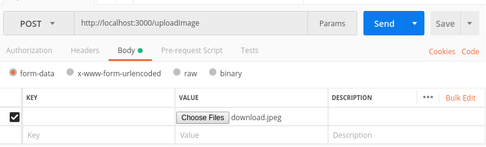

# Serverless REST API to Upload Image to S3 with offline support

This example demonstrates how to run a service locally, using the
[serverless-offline](https://github.com/dherault/serverless-offline) plugin.

## Note
* Change your `bucket name` and `region` in `serverless.yml` file.

## Use-case

Test S3 image upload service locally, without having to deploy it first.

## Setup

```bash
npm install
serverless offline start
```

## Run service offline

```bash
serverless offline start
```

## Usage

### Upload Image to S3

```bash
http://localhost:3000/uploadImage
```
Using postman you can test it as shown in below:




Response:
```bash
{
    "message": "Image uploaded",
    "data": {
        "ETag": "\"<ETag>\"",
        "Location": "https://<Your_Bucket_Name>.s3.<Your_Region>.amazonaws.com/<Uploaded File with path>",
        "key": "<Uploaded File with path>",
        "Key": "<Uploaded File with path>",
        "Bucket": "<Your_Bucket_Name>"
    }
}
```